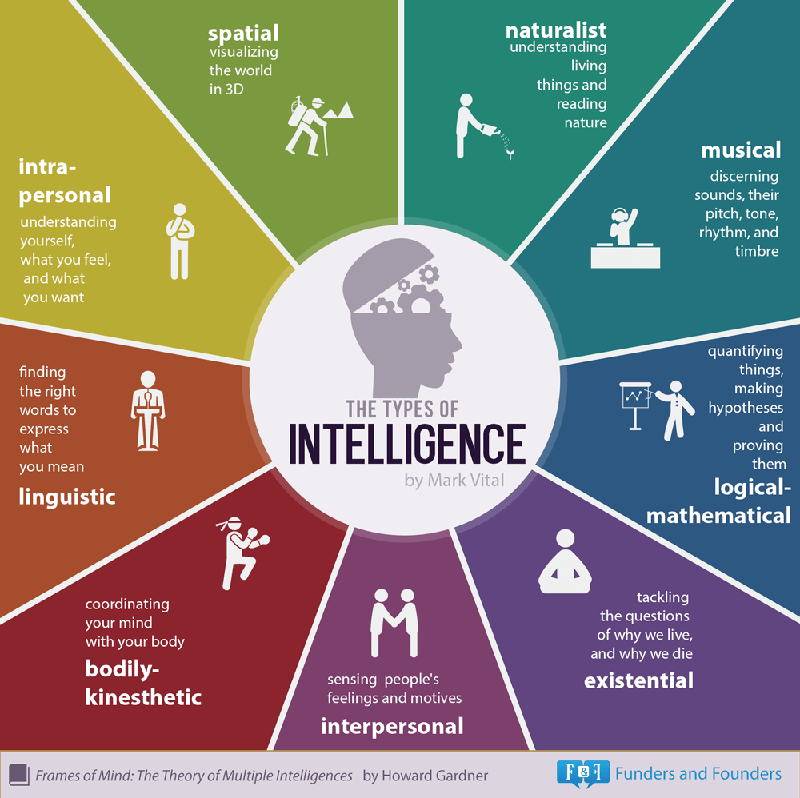

# Estratégias para familiares no incentivo ao Desenvolvimento Cognitivo de descendentes
Estratégias para familiares no incentivo ao desenvolvimento cognitivo de crianças e adolescentes.
Este projeto é focado nas recomendações de presentes e abordagem das pessoas que
tem contato direto com os jovens pra incetivar criatividade e potencialmente
melhorar diferentes tipos de inteligência.

Alguns pontos-chave

- É voltado para familiares
  - Assume que não há conhecimento pessoal ou profissional em áreas como educação e psicologia
- Assumem que a mãe e o pai trabalham durante a semana e que parte do dia um familiar ou babá cuidarão da criança
- Os presentes, sempre que possível, devem ser baratos
  - Nem todas as famílias tem dinheiro extra
  - Isso também estimula dar presentes para parentes ou doações para terceiros
- Estímulo a multidisciplinaridade, criatividade e conscientizar sobre abordagens que geram auto-boicote na criança
  - _"Elogie o esforço, não a inteligência"_
  - Mesmo que uma criança passe a ser boa em algo, sugere fortemente a família
não reforçar isso em dentrimento forte de outras habilidades
  - Estimulo a interação com colegas, mesmo fora da aula

Acesse também [Matriarcado Cognitivo](https://github.com/fititnt/matriarcado-cognitivo).

## O que é Desenvolvimento Cognitivo

> "O desenvolvimento cognitivo é um campo de estudo da neurociência e psicologia
> focada no desenvolvimento de uma criança em termos de processamento de informações,
> recursos conceituais, habilidade perceptiva, a aprendizagem de línguas,
> e outros aspectos do desenvolvimento do cérebro em relação ao ponto de vista de um adulto.
> Em outras palavras, o desenvolvimento cognitivo é o processo do surgimento da capacidade de pensar e compreende."
> -- [Fonte: Wikipédia](https://pt.wikipedia.org/wiki/Desenvolvimento_cognitivo)

_Nota: melhorar explicação (fititnt, 2017-03-13 22:43)_